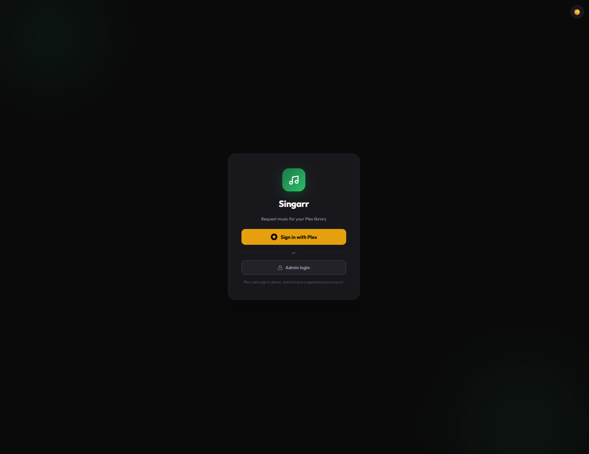
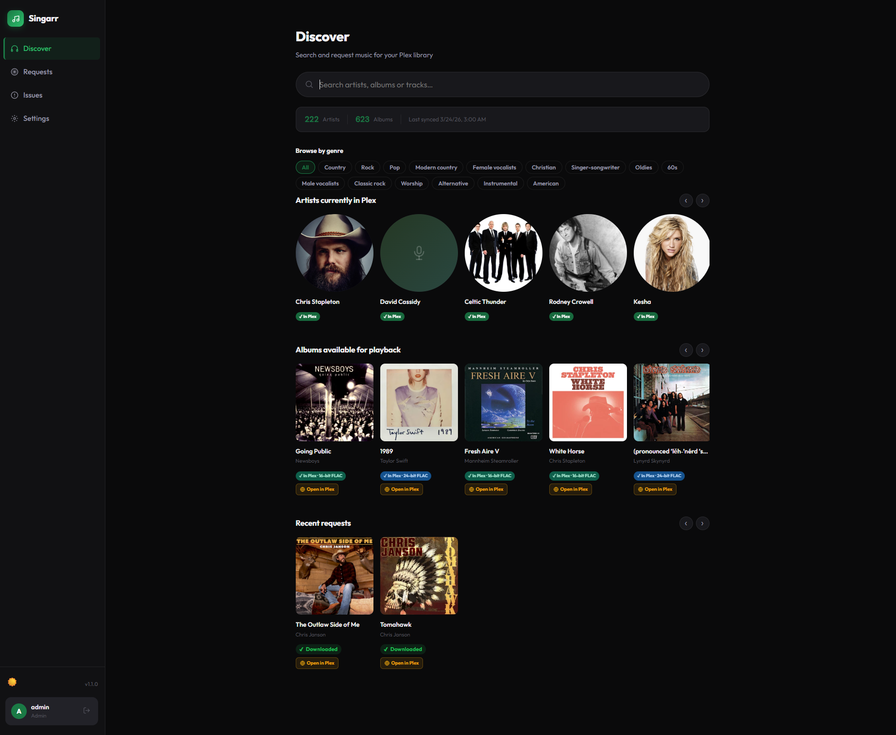
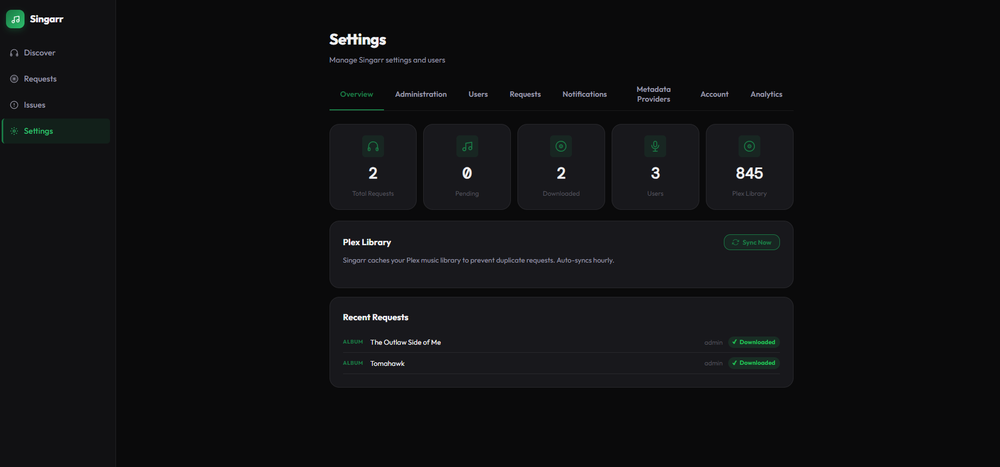
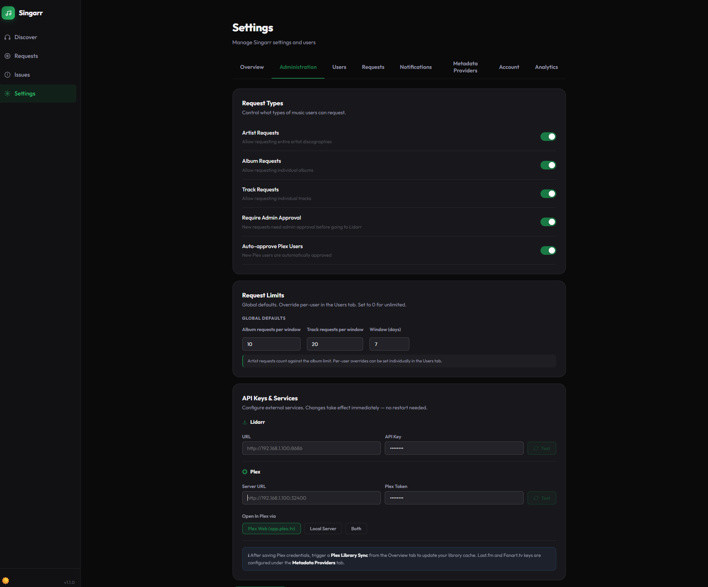
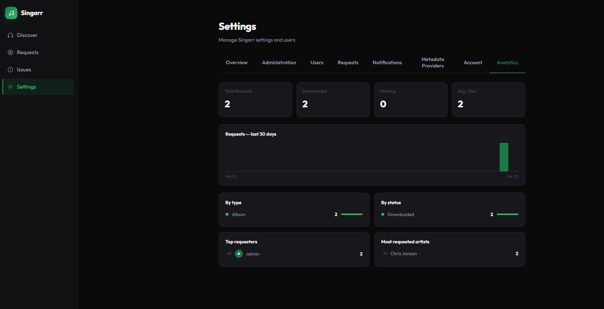

# 🎵 Singarr

Singarr is an Overseerr-style music request app for Plex + Lidarr. Users log in with their Plex account and can request artists, albums, or tracks. Requests are automatically sent to Lidarr for acquisition.

**Docker Hub:** `rustypie/singarr:latest` · **Port:** `8684`

---

## Screenshots











---

## Features

### Core
- 🔐 **Plex OAuth login** — users sign in with their Plex account; local admin account also supported
- 🎵 **Request artists, albums, or tracks** — each type can be toggled on/off by admins
- 📚 **Plex library awareness** — prevents requesting content already in your library
- 🚦 **Request limits** — separate global limits for albums and tracks, with per-user overrides
- 📊 **Status tracking** — pending → approved → found → downloading → downloaded
- ⚙️ **Admin panel** — manage users, settings, and all requests
- 🎨 **Dark & light themes** — smooth, polished UI
- 🐳 **Single Docker container** — nginx + Node.js managed by supervisord

### Search
- 🔍 **Full search** — Artists, Albums, EPs & Singles, Compilations, Live Albums, Tracks
- 🎤 **Artist expansion** — click an artist to browse their albums, click an album to see tracks
- 📄 **Pagination** — all search tabs support multiple pages of results
- ✅ **Plex & quality badges** — search results show if content is already in Plex with audio quality (16-bit / 24-bit FLAC)

### Discover Page
- 🎨 **Artist images** — powered by Fanart.tv with Plex thumbnail fallback
- 💿 **Album art** — powered by Last.fm with Plex thumbnail fallback
- 🏷️ **FLAC quality badges** — albums show 16-bit or 24-bit FLAC status
- 🎸 **Genre browsing** — filter your library artists by genre
- 🎯 **Similar artists** — after requesting an artist, see similar artist suggestions from Last.fm
- ▶️ **Open in Plex** — one-click buttons to open albums in Plex Web or your local server
- 📬 **Recent requests** — see what's been recently requested with play buttons for downloaded items

### Issues
- 🐛 **Issue reporting** — users can report problems with downloaded music
- 💬 **Threaded notes** — real-time discussion thread on each issue via Server-Sent Events
- 🔒 **Locked threads** — resolved issues are locked; status progression is one-way
- 📧 **Email notifications** — admin notified on new issues; user notified on status changes and replies

### Admin
- 👥 **User management** — import Plex users, set request limits, promote to admin
- 📊 **Analytics** — request trends, breakdowns by type/status, top requesters, most requested artists
- 🔔 **Email notifications** — configurable SMTP with per-event toggles
- 🔁 **Auto-sync** — Plex library syncs hourly; manual sync available from Overview
- 🌐 **Open in Plex setting** — choose Plex Web, Local Server, or both for play buttons

---

## Quick Start

### Portainer / Docker Compose

```yaml
version: '3.8'
services:
  singarr:
    image: rustypie/singarr:latest
    container_name: singarr
    restart: unless-stopped
    ports:
      - "8684:8684"
    environment:
      - JWT_SECRET=your_long_random_secret
      - PLEX_CLIENT_ID=singarr
      - APP_URL=http://your-server:8684
    volumes:
      - singarr-data:/app/data

volumes:
  singarr-data:
```

Open `http://your-server:8684` in your browser. **The first user to log in becomes the admin automatically.**

---

## API Keys

All API keys are configured inside the app under **Settings → Administration** and **Settings → Metadata Providers**. No `.env` file required for normal use.

| Service | Where to get it | Required |
|---|---|---|
| Plex Token | Settings → Administration → Plex | ✅ |
| Lidarr API Key | Lidarr → Settings → General | ✅ |
| Last.fm API Key | https://www.last.fm/api/account/create | Recommended |
| Fanart.tv API Key | https://fanart.tv/get-an-api-key | Recommended |

---

## Environment Variables

Only required if you prefer to configure via environment instead of the UI:

```env
# Security — generate with: openssl rand -hex 32
JWT_SECRET=your_long_random_secret

# Optional — can be set in UI instead
PLEX_URL=http://192.168.1.100:32400
PLEX_TOKEN=your_plex_token
LIDARR_URL=http://192.168.1.100:8686
LIDARR_API_KEY=your_lidarr_api_key
LASTFM_API_KEY=your_lastfm_key
FANART_API_KEY=your_fanart_key
```

---

## Admin Guide

### Request Limits
- **Album limit** and **Track limit** are configured separately (default: 10 albums / 20 tracks per 7 days)
- Per-user overrides available in Settings → Users
- Admins are exempt from all limits

### User Management
- Import Plex users directly from your Plex friends/home users list
- Approve/reject new users, promote to admin, set custom limits
- Display names supported for local admin account

### Plex Library Sync
Singarr caches your Plex library hourly. The sync populates:
- Artist and album metadata for duplicate detection
- MusicBrainz IDs for Fanart.tv image lookup
- Audio quality info (FLAC bit depth) for quality badges
- Genre tags from Last.fm for genre browsing

Trigger a manual sync from **Settings → Overview → Sync Now**.

### Open in Plex
Configure under **Settings → Administration → Open In Plex via**. Choose:
- **Plex Web** — opens `app.plex.tv` (works from anywhere)
- **Local Server** — opens your Plex server directly (faster on local network)
- **Both** — shows both buttons

Requires clicking **Test Connection** or running a **Sync Now** once to detect your Plex server's machine ID.

---

## Architecture

Single Docker container running:
- **nginx** on port 8684 — serves the React frontend and proxies API requests
- **Node.js** on port 3001 (internal) — Express API backend
- **SQLite** at `/app/data/singarr.db` — all data persisted in a Docker volume
- **supervisord** — manages nginx and Node.js processes

```
singarr/
├── Dockerfile
├── nginx.conf
├── supervisord.conf
├── backend/          # Node.js + Express API
│   └── src/
│       ├── server.js
│       ├── db.js           # SQLite via better-sqlite3
│       ├── routes/         # auth, requests, search, admin, plex, discover, issues
│       ├── services/       # lidarr, plex, limits, email
│       └── middleware/     # auth guards
└── frontend/         # React + Vite
    └── src/
        ├── pages/          # Home, Requests, Issues, Admin
        ├── components/     # Layout, RequestModal, StatusBadge, etc.
        └── contexts/       # AuthContext, ThemeContext
```

**Stack:** React · Vite · Framer Motion · Express · SQLite · nginx · supervisord  
**Metadata:** MusicBrainz · Cover Art Archive · Last.fm · Fanart.tv

---

## Updating

To update to the latest version:

```bash
docker pull rustypie/singarr:latest
docker compose up -d
```

Your database is stored in a Docker volume and persists across updates.

---

## Troubleshooting

**Can't log in with Plex?**  
Check that your Plex URL and token are correct in Settings → Administration.

**Requests not going to Lidarr?**  
Verify your Lidarr URL and API key. Make sure Lidarr has at least one quality profile and root folder configured.

**No album art or artist images?**  
Check your Last.fm and Fanart.tv API keys in Settings → Metadata Providers. Run a Plex Library Sync after adding keys.

**Genre browsing not showing?**  
Genres are populated during a Plex Library Sync and require a valid Last.fm API key. Run a sync after configuring.

**Open in Plex buttons not appearing?**  
Click Test Connection on your Plex settings or run a Sync Now — this detects and stores your Plex server's machine ID which is required for the deep links.

**Check logs:**
```bash
docker logs singarr --tail=50
```
